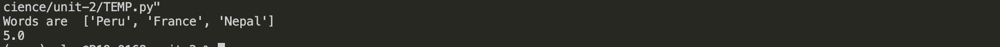

# Quizz 17
The first quizz of this repo

### Programm
    
```python

def averageLenght(words: str):
    #remove spaces
    for i in words:
        if i == ' ':
            words = words.replace(i, '')
    return sum(len(word) for word in words) / len(words)

world = ["Peru", "France", "Nepal"]
out = averageLenght(world)
print(out)

```
### Proof


**Fig. 1** Proof