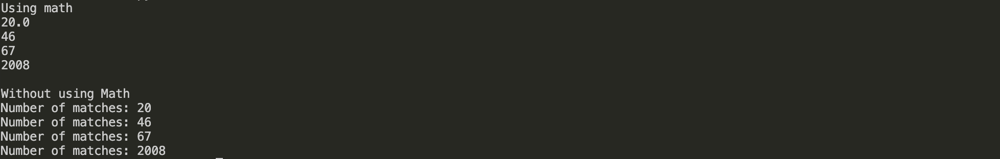

# Quizz 18

### Part 1
```python
def numberMatchesMath(l, s):
    matches = 20*l/s
    # check if float
    if matches % 1 != 0:
        matches = int(matches) + 1
    return matches

print("Using math")
print(numberMatchesMath(100, 100))
print(numberMatchesMath(250, 110))
print(numberMatchesMath(500, 150))
print(numberMatchesMath(12345, 123))

def numberMatchesNoMath(l, s):
    l = 20*l
    matches = 0
    while l > 0:
        l = l-s
        matches = matches+1
    return ("Number of matches: " + str(matches))


print("\n"+"Without using Math")
print(numberMatchesNoMath(100, 100))
print(numberMatchesNoMath(250, 110))
print(numberMatchesNoMath(500, 150))
print(numberMatchesNoMath(12345, 123))
```
Proof

**Fig. 1** Proof


### Part 2
Thruth table of:
```
ABC+(A+B+C)+not(notA notB notC)
ABC+(A+B+C)+(A+B+C)
ABC+(A+B+C)
```

| A | B | C | ABC+(A+B+C)+not(notA notB notC) | ABC+(A+B+C)+(A+B+C) | ABC+(A+B+C) |
|---|---|---|---|---|---|
| 0 | 0 | 0 | 0 | 0 | 0 |
| 0 | 0 | 1 | 1 | 1 | 1 |
| 0 | 1 | 0 | 1 | 1 | 1 |
| 0 | 1 | 1 | 1 | 1 | 1 |
| 1 | 0 | 0 | 1 | 1 | 1 |
| 1 | 0 | 1 | 1 | 1 | 1 |
| 1 | 1 | 0 | 1 | 1 | 1 |
| 1 | 1 | 1 | 1 | 1 | 1 |


