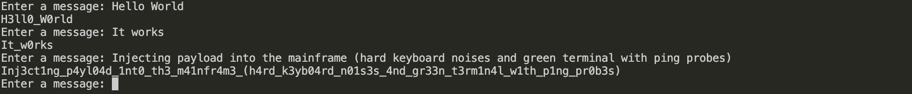
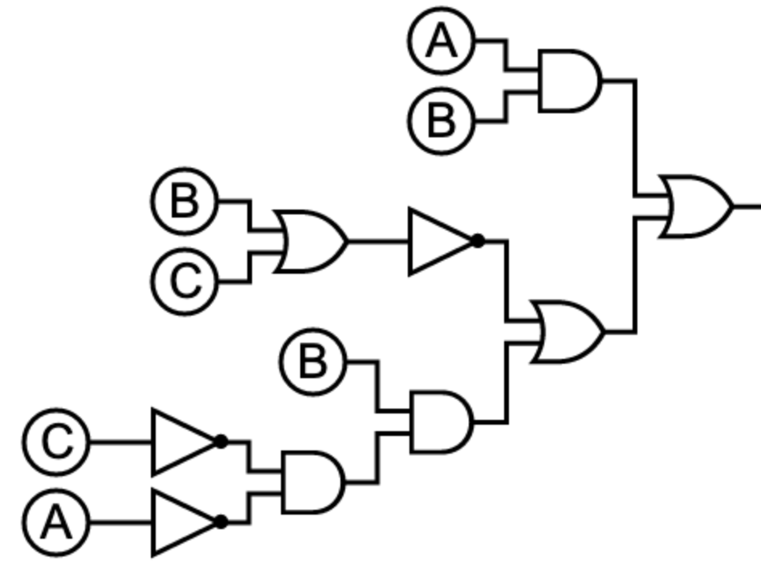

# Quizz 19
## Part 1

```python
def get_l3tt3r(msg):
    output = ""
    # split msg into letters
    msg = list(msg)
    # remplacing a=4, e=3, i=1, o=0 and " " = "_" with a dictionary
    dic = {"a":"4", "e":"3", "i":"1", "o":"0", " ":"_"}
    for i in range(len(msg)):
        if msg[i] in dic:
            output += dic[msg[i]]
        else:
            output += msg[i]
    return output
        

while True:
    msg = input("Enter a message: ")
    print(get_l3tt3r(msg))
```
Proof

**Fig. 1** Proof

## Part 2



**Fig. 2** Logic circuit for AB + not(B+C) + B(notC notA)