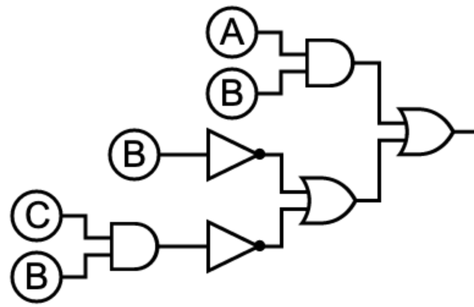

# Quizz 21

## Part 1

```python
def get_truth():
    truth = []
    print("| A | B | C | O |")
    for i in range(8):
        truth.append([i//4, (i//2)%2, i%2])
        if ((i//4) == 1 and (i//2 == 1)) or (i//2 == 0) or ((i//2 == 0 and i%2 == 1)):
            print("|", truth[i][0], "|", truth[i][1], "|", truth[i][2], "|", "1", "|")
        else:
            print("|", truth[i][0], "|", truth[i][1], "|", truth[i][2], "|", "0", "|")
get_truth()
```

**Fig. 1** Proof

## Part 2


**Fig. 2** Logic circuit for X = AB + (not(B+C)(not B))


| A | B | C | X |
|---|---|---|---|
| 0 | 0 | 0 | 0 |
| 0 | 0 | 1 | 1 |
| 0 | 1 | 0 | 1 |
| 0 | 1 | 1 | 1 |
| 1 | 0 | 0 | 0 |
| 1 | 0 | 1 | 1 |
| 1 | 1 | 0 | 0 |
| 1 | 1 | 1 | 1 |

**Fig. 3** Truth table for X = AB + (not(B+C)(not B))