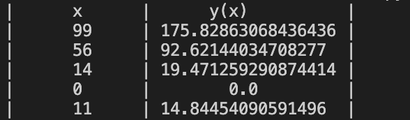
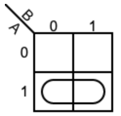

# Quizz 22

### Part 1 
```python
import random
random.seed(1234)

def produce(n,m,s):
    print("|      x      |      y(x)          |")
    for i in range(n):
        x = random.randint(0,100)
        y = (x ** (0.5*((m/s)**2)))
        x = str(x).center(13)
        y = str(y).center(20)
        print("|" + x + "|" + y + "|")

produce(5,3,2)
```


**Fig. 1** Proofs

### Part 2
Why A(A+B) = A in bolean algebra?



**Fig. 1** When i draw the K Table
We can see that only A is the factor so A(A+B) = A
