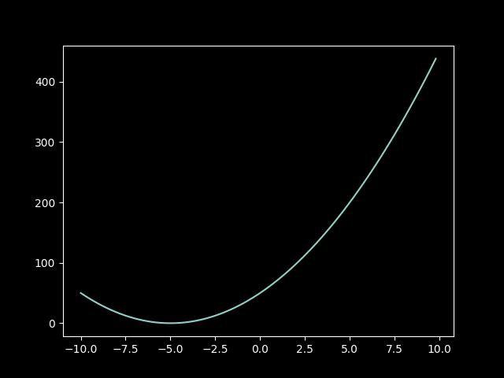
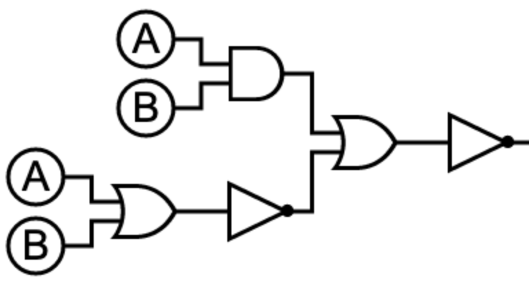

# Quizz 24
## Part 1
```python
import random
import matplotlib.pyplot as plt
print("loaded matplotlib")
plt.style.use('dark_background')

def parabola(x):
    return 2*((x+5)**2)


x = []
y = []
for i in range(100):
    number = -10 + i * 0.2
    x.append(number)
    y.append(parabola(number))
    print(i)

print("x: ", x)
print("y: ", y)
plt.plot(x, y)
plt.show()
```

**Fig. 1** Proof

## Part 2
Logic circuit for not(A B + not(A +B))

**Fig. 2** Logic circuit for not(A B + not(A +B))