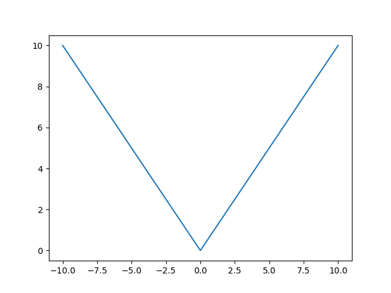

# Quizz 25
## Part 1 
```python
from matplotlib import pyplot as plt
print("loaded matplotlib")

def box(x):
    return abs(x)


x = []
y = []
for i in range(-10, 11, 1):
    x.append(i)
    y.append(box(i))

print("x: ", x)
print("y: ", y)
plt.plot(x, y)
plt.show()
```


**Fig. 1** Proofs

## Part 2
Convert FFA5 to decimal
$FFA5 = (FFA5)₁₆ = (15 × 16³) + (15 × 16²) + (10 × 16¹) + (5 × 16⁰) = (65445)₁₀$