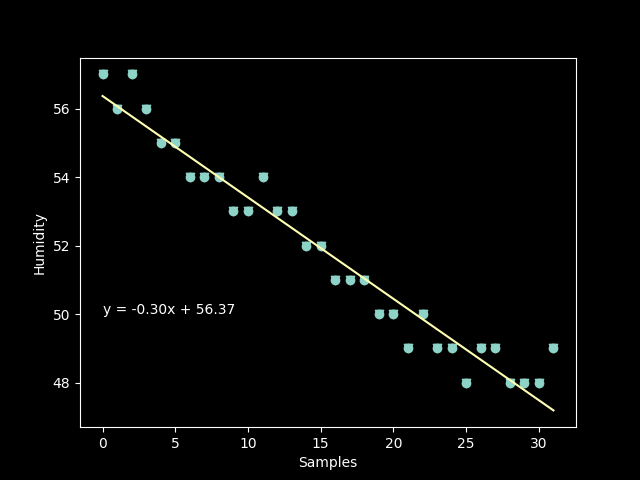

# Quizz 26
### Part 1
```python
import matplotlib.pyplot as plt
import numpy as np
plt.style.use('dark_background')


h = [57.0, 56.0, 57.0, 56.0, 55.0, 55.0, 54.0, 54.0, 54.0, 53.0, 53.0, 54.0, 53.0, 53.0, 52.0, 52.0, 51.0, 51.0, 51.0, 50.0, 50.0, 49.0, 50.0, 49.0, 49.0, 48.0, 49.0, 49.0, 48.0, 48.0, 48.0, 49.0]


samples = []
for i in range(0, len(h)):
    samples.append(i)

plt.scatter(samples, h, marker="v")
plt.ylabel("Humidity")
plt.xlabel("Samples")


a, b = np.polyfit(samples, h, 1)

plt.plot(samples, h, 'o', samples, a*np.array(samples) + b, '-')
plt.text(0, 50, 'y = %.2fx + %.2f' % (a, b))
plt.show()
```


**Fig. 1** Proof