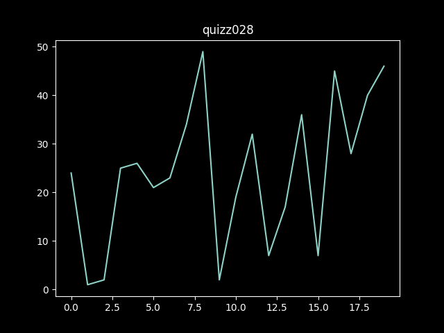

# Quizz 28
### Part 1
```python
import matplotlib.pyplot as plt

plt.style.use('dark_background')

data = {
    "title": "quizz028",
    "x": [0, 1, 2, 3, 4, 5, 6, 7, 8, 9, 10, 11, 12, 13, 14, 15, 16, 17, 18, 19],
    "y": [24, 1, 2, 25, 26, 21, 23, 34, 49, 2, 19, 32, 7, 17, 36, 7, 45, 28, 40, 46]
}

plt.plot(data["x"], data["y"])
plt.title(data["title"])
plt.show()
```


**Fig. 1** Proof

